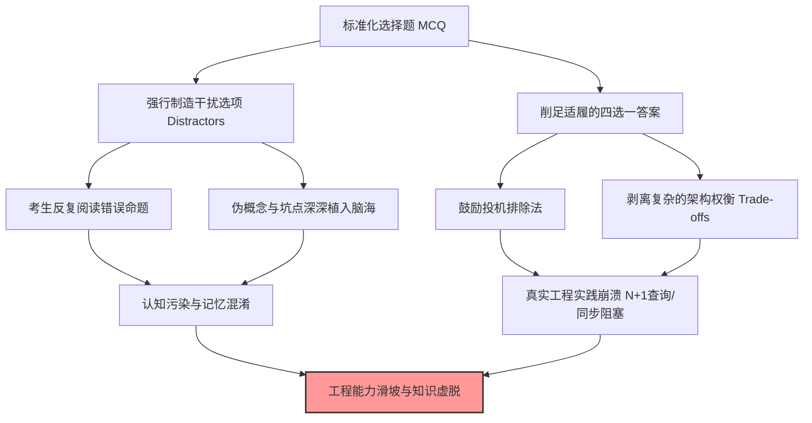

在技术招聘、认证考试乃至计算机专业教学中，标准化选择题（Multiple-Choice Questions, MCQ）因其“自动批改成本极低、评分客观绝对”而被广泛滥用。

然而，在真正的软件工程与系统架构实践面前，选择题暴露出了冷酷的评估无能：

**选择题根本考不出一个开发者的真实工程水准。**

软件工程的本质是系统设计、权衡取舍（Trade-offs）、代码重构与复杂 Bug 的定位；而选择题强制将这些充满动态演进的工程实践，削足适履地压缩为四选一的固定定论。

更加可怕的是，选择题带来了一种极其危险的**“认知污染”**——为了凑满 A、B、C、D 四个选项，命题人必须大量编造看似合理实则完全错误的干扰项（Distractors）。考生在刷题与备考过程中，不得不反复阅读、琢磨并记忆这些被故意制造出来的错误命题，最终导致**“正统机制没记住多少，错误的伪概念与假逻辑却深深植入了大脑”**。

---

### 1. Django 领域的典型害人选择题剖析

以著名的 Python Web 框架 Django 为例，选择题命题人最喜欢在 ORM、中间件与信号量（Signals）上布置极其恶毒的干扰项：

#### 案例一：Django ORM 查询机制与 N+1 性能陷阱

不妨看一道标准的 Django 笔试选择题：

> 关于 Django ORM 的查询与性能优化，下列说法**正确**的是（ ）：
>
> A. `models.Book.objects.filter(category="Python")` 被执行时，会立即向数据库发送 SQL SELECT 查询语句。  
> B. `select_related()` 专门用于优化 `ManyToMany` 关系，而 `prefetch_related()` 专门用于优化单向 `ForeignKey` 关系。  
> C. `Book.objects.filter(price__gt=50).delete()` 在批量删除时，会依次触发每一个 `Book` 模型的 `delete()` 方法与相关 `pre_delete` 信号。  
> D. `select_related()` 通过 SQL JOIN 在一次查询中获取关联对象，而 `prefetch_related()` 则通过多条 SQL 查询在 Python 内存中进行数据拼装。

正确答案是 **D 选项**。

但这道题对考生的认知污染却是极其灾难性的：

- **选项 A 的污染**：很多新手在反复做这道题后，脑子里会留下“`filter()` 会发送 SQL”的潜意识印象，完全忽略了 Django ORM **惰性求值（Lazy Evaluation）** 的核心机制（只有在求值、迭代、切片或调用 `list()` 时才会真正触发数据库 IO）。
- **选项 B 的污染**：选项 B 把 `select_related` 与 `prefetch_related` 的适用场景彻底颠倒了（`select_related` 用于 `ForeignKey/OneToOne` 的 SQL JOIN，而 `prefetch_related` 才用于 `ManyToMany`）。由于干扰项的用词极其顺口，大量考生在考场上记混了这个颠倒的结论。结果在实际开发中，在 `ManyToMany` 上滥用 `select_related` 导致代码报错崩塌，或者在 `ForeignKey` 上滥用 `prefetch_related` 导致原本可以一条 SQL JOIN 完成的操作变成了 N+1 条查询，导致线上数据库 CPU 飙升。
- **选项 C 的污染**：选项 C 故意制造了关于 `QuerySet.delete()` 是否触发模型方法与信号量的伪知识。

#### 案例二：Django 中间件（Middleware）与信号（Signals）的虚假生命周期

> 下列关于 Django 中间件与信号的说法中，**错误**的是（ ）：
>
> A. 自定义中间件的 `process_request` 方法如果返回了一个 `HttpResponse` 对象，Django 会继续向下调用视图函数（View）。  
> B. 中间件的执行顺序严格按照 `settings.py` 中 `MIDDLEWARE` 数组的声明顺序从上往下执行请求阶段。  
> C. `process_exception` 会在视图函数抛出未捕获异常时触发。  
> D. Django 信号（Signals）的解耦机制是在单独的线程池中异步执行回调函数的。

在这道题中，选项 A 和选项 D 全都是命题人编造的纯粹谎言！

- **选项 A 颠倒了短路机制**：`process_request` 一旦返回 `HttpResponse`，就会直接短路跳过后续的所有视图函数和中间件。
- **选项 D 制造了巨大的误导**：**Django 信号默认是完全同步执行的**，根本没有所谓的“默认异步线程池”。

大一堆初学者在刷完这道选择题后，以为 Django 信号是异步的，于是在异步任务场景中放心地使用 Signal 替代 Celery，导致 HTTP 请求被同步耗时任务卡死几十秒。

---

### 2. 跨越生死的灾难：特种电工考试里的 10 个致命干扰陷阱

在 IT 领域，选择题记错 `select_related` 最多导致线上数据库 CPU 飙升或卡死；但在高压与强电领域，选择题给出的**错误干扰选项（Distractors）**，却能直接酿成触电身亡、爆炸与火灾等流血惨剧！

考生在刷题时成百上千次地阅读那些编造出来的错误选项，极其容易在突发事故中产生错误的肉体记忆：

1. **触电急救第一步**：
   - 干扰项误导：“发现有人触电，应立即用手将其拉离电源。”
   - 致命后果：未学透的人在急救瞬间凭被干扰项污染的本能记忆伸手去拉，导致施救者瞬间连带触电身亡。
2. **保护接地与保护接零混接**：
   - 干扰项误导：“工作零线（N）与保护接地线（PE）可以在设备端随意互换使用。”
   - 致命后果：在实际配电箱中混接零地线，会导致用电设备金属外壳瞬间带上 220V 危险电压。
3. **高压停电检修安全顺序**：
   - 干扰项误导：“高压停电检修时，应先挂接地线，再进行验电。”
   - 致命后果：顺序颠倒会导致接地线直接挂在带电的高压母线上，引发强烈的高压电弧闪络与金属性短路爆炸。
4. **电气火灾灭火器选择**：
   - 干扰项误导：“带电电气设备发生火灾，应优先使用水型或泡沫灭火器。”
   - 致命后果：液体灭火介质形成导体，灭火人员瞬间遭受高压电击。
5. **35kV 高压作业最小安全距离**：
   - 干扰项误导：“工作人员与 35kV 带电体的最小安全距离为 0.5m。”（实际无安全遮栏时应为 1.0m）。
   - 致命后果：0.5m 距离早已击穿空气绝缘层，引发高压电弧直接烧伤人体。
6. **漏电保护器（RCD）替代**：
   - 干扰项误导：“安装了漏电保护器后，可以不再安装过载熔断器。”
   - 致命后果：漏电保护器无法代替过载与短路保护，线路长期过载发热引爆火灾。
7. **电力电容器停电后处理**：
   - 干扰项误导：“电容器组切断电源后，即可立即进行手部检修。”
   - 致命后果：电容器内部残存数千伏高压电荷，未充分放电前接触会遭受致命残余电击。
8. **临时用电“一机一闸一漏”**：
   - 干扰项误导：“为节省成本，一台漏电保护开关可以拖带多台用电设备。”
   - 致命后果：多台设备越级越闸，某台设备漏电时 protection 无法精准切断，导致触电范围扩大。
9. **绝缘工具检验周期**：
   - 干扰项误导：“绝缘手套与绝缘鞋只要外观没有明显破损，即可永久使用。”
   - 致命后果：绝缘层内部老化击穿肉眼不可见，带电作业时直接穿透绝缘造成伤亡。
10. **单相三孔插座接线**：
    - 干扰项误导：“三孔插座的接线规则是左火右零上地。”（正确应为左零右火上地）。
    - 致命后果：颠倒火零线导致单极开关切断的是零线，设备内部电路长期带电。

---

### 3. 悬在道路上的达摩克利斯之剑：驾照理论考试里的 10 个车毁人亡陷阱

驾照科目一与科目四的理论选择题，同样是将极度复杂的紧急驾驶处置，简化为了四选一的纸上谈兵。

驾驶员在刷题时被迫记忆大量扭曲的错误干选项，会在生死一瞬的应急反应中引发车毁人亡的灾难：

1. **高速公路爆胎紧急处置**：
   - 干扰项误导：“车辆在高速公路行驶中突发爆胎，应立即急踩制动踏板（踩死刹车）。”
   - 致命后果：时速 120km/h 爆胎时急踩刹车，车辆会在 0.5 秒内发生剧烈侧翻，车毁人亡。正确做法应是紧握方向盘、缓抬油门。
2. **水滑现象（Hydroplaning）避让**：
   - 干扰项误导：“路面积水发生‘水滑’导致转向失灵时，应迅速向相反方向急打方向盘避让。”
   - 致命后果：急打方向盘会导致轮胎恢复附着力的瞬间车辆瞬间甩尾翻车。
3. **车辆落水自救黄金期**：
   - 干扰项误导：“车辆落水后，应等水完全淹没车厢、内外水压平衡后再尝试打开车门。”
   - 致命后果：水完全淹没后车内空气耗尽，伤员在极度恐慌与窒息中失去意识，错失刚落水的前 30 秒黄金逃生期。
4. **长下坡连续制动**：
   - 干扰项误导：“车辆在长下坡路段行驶时，应持续踩住制动踏板控制车速。”
   - 致命后果：长期踩刹车导致刹车片急剧升温发生热衰竭，刹车彻底失灵冲出悬崖。
5. **高速公路错过出口**：
   - 干扰项误导：“在高速公路上错过出口时，可在确认后方无车时缓慢倒车或掉头。”
   - 致命后果：高速主路倒车是引发多车高速追尾相撞的最主要惨剧源头。
6. **夜间会车远光灯**：
   - 干扰项误导：“夜间在没有路灯的道路会车时，应持续开启远光灯以看清对方车道。”
   - 致命后果：远光灯导致对向驾驶员瞬间全盲，引发正面相撞。
7. **大雾天气行驶灯光选择**：
   - 干扰项误导：“大雾天气视野受阻时，应开启远光灯以提高穿透力。”
   - 致命后果：远光灯在大雾颗粒中产生强烈漫反射，形成白茫茫光幕，驾驶员瞬间视线全黑。
8. **盲区弯道超车**：
   - 干扰项误导：“在急弯道或前方有遮挡的视线盲区，可加速超越慢速前车。”
   - 致命后果：盲区对向来车避让不及，发生极高死亡率的对头碰撞。
9. **紧急避险原则**：
   - 干扰项误导：“在面对不可避免的碰撞时，应优先避物后避人，或者急打方向盘转向躲避。”
   - 致命后果：急打方向盘会导致车辆侵入对向车道或侧翻，引发更大规模伤亡。
10. **交通事故骨折伤员搬运**：
    - 干扰项误导：“发现事故伤员脊柱骨折时，应由两人分别抱头和拉脚快速抬上救护车。”
    - 致命后果：弯曲拖拉脊柱导致断骨刺穿中枢神经，造成伤员终身截瘫。

---

### 4. 选择题机制对工程思维的深层毒害

为什么说选择题不仅考不出水准，反而是在摧毁考生的工程能力？

#### A. 伪知识强化与直觉互通下的逆向加深

心理学与认知科学研究表明：**人类大脑对于“经常看过的文本”具有天然的熟悉感偏置，且在长期遗忘的过程中，反而更容易记住并强化完全错误的干扰选项。**

在选择题考试中，75% 的选项都是命题人为了扣分而编造的错误假命题。当考生成千上万次地阅读“`select_related` 用于多对多”、“信号是异步的”、“`filter` 立即发 SQL”这些错误选项时，大脑会无意识地将这些错误短语识别为“熟悉知识”，最终在实际代码编写中产生致命的误操作。

这种现象背后的根源在于：出题人在编造干扰选项（Distractors）时，并非无中生有，而是**直接取材于人类大脑底层最天然的思维误区与直觉偏差**（例如直觉上觉得“加了 `filter` 就该立即发 SQL”、“爆胎了就该踩刹车”、“有人触电了就该伸手去拉”）。这种错误直觉在出题人与受考者之间是完全互通的。

然而，真正的专业知识往往是反直觉的、高度抽象的。当考试结束、专业记忆随着时间流逝逐渐衰退后，那些抽象严谨的正确结论最先被遗忘；**而那个与人类底层直觉高度互通的错误干扰项，却在脑海中与原始直觉再次合流、反向加深！**

当考生成千上万次地阅读过这些错误选项后，随着时间的推移，错误答案在脑海中反而越扎越深，最终彻底鸠占鹊巢——在考完试几年后，人们脑子里记住的全是出题人精心诱导的伪知识与致命误区，并在实际开发或应急处置中引发致命后果。

#### B. 剥离了软件工程的内核——权衡（Trade-offs）
在真实软件开发中，很少有绝对的“对”与“错”。

例如：“要不要加缓存？”、“要用规范化数据库还是反规范化设计？”、“要用同步视图还是异步视图？”——这些问题的答案永远是 **“视情况而定（It depends）”**。

而选择题强制要求给出非黑即白的单选结果。它培养出来的不是懂得权衡系统瓶颈、架构演进的工程师，而是只会寻找“参考标准答案”的答题机器。

#### C. 鼓励投机与盲猜，惩罚深度探索
选择题使得“通过排除法猜对”与“真正懂底层原理”获得了完全相同的得分。它鼓励考生学习“排除干扰项技巧”、“看关键词找破绽”，却惩罚了那些在复杂工程中动手实践、通过阅读源码掌握真知的人。

---

### 5. 结语：从选择题的迷信中解脱

如果我们要评估一个程序员真正的 Django 或 Web 开发水准：
- 给他们一段包含 N+1 查询与未加索引的缓慢慢查询代码，让他们定位并完成性能重构；
- 让其设计一个高并发下保证数据一致性的订单扣减接口；
- 让其写一段自定义中间件来处理全局鉴权与速率限制。

这些真实的工程实践，远比死记硬背四个编造出来的选择题选项要深刻一万倍。

**不要让四选一的选择题框定了你的工程视野，更不要让恶毒的干扰选项污染了你的真知。** 走出选择题的误区，在代码与系统构建的真实战场中去寻找真正的工程力量。
