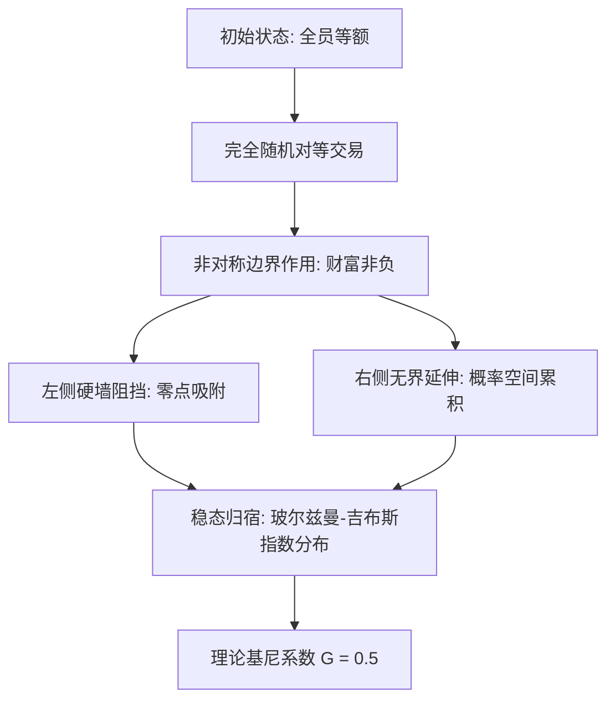
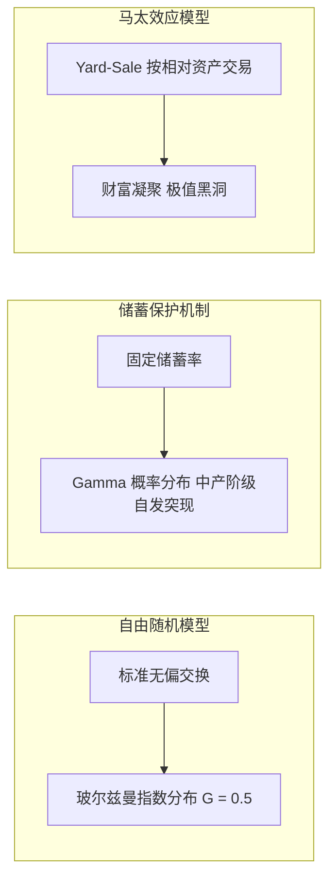
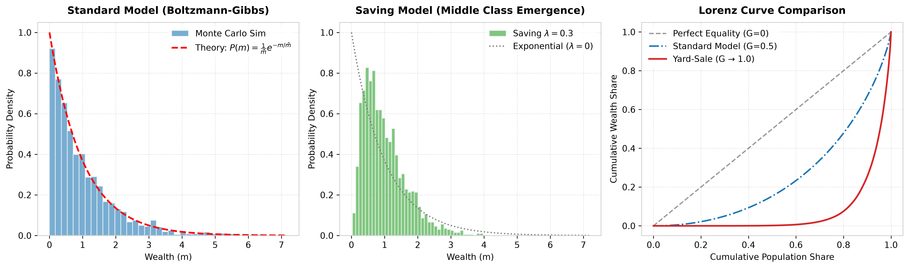

笔试想这样一个简单游戏：房间里有 100 个人，每个人初始都有 100 块钱。

游戏规则极其公平且完全随机：每轮随机挑出两个人抛硬币，输的人给赢的人 1 块钱。规则不偏袒任何人，唯一的底线是输光到 0 块钱的人不能负债借钱。

直觉上，大家初始资金一样，胜率也是五十对五十，玩久了似乎手里应该还是各拿 100 块左右。然而真实演化出的答案却极其反直觉：**只要玩得足够久，系统会自发分化成绝大多数人极其贫穷、极少数人坐拥巨款的极端状态 (指数分布)。**

这种严重的贫富分化，不需要阴谋论、不需要能力差异，也不需要复杂的剥削——它纯粹是系统在“钱数守恒”与“不能负债”两个基本约束下，追求 **最大熵 (MaxEnt)** 的物理必然。



### 1. 无偏碰撞与最大熵分布

在标准随机交易模型中，设系统包含 $N$ 个个体，总财富量为 $M$，第 $i$ 个个体的财富记为 $m_i$。演化过程中每轮随机抽取两人发生对等交易。交易仅改变两人间的财富分配，系统总财富保持守恒，且任何个体的财富均受非负约束限制：

$$
\sum_{i=1}^{N}m_i=M,\qquad m_i\ge 0
$$

该模型去除了个体能力差异、信息优势、地理位置以及工资、投资、税收、继承或债务利息等现实经济要素，仅保留“总财富守恒”与“财富非负”两项基本条件。

Dragulescu 与 Yakovenko 在 2000 年的奠基性论文 [Statistical mechanics of money](https://arxiv.org/abs/cond-mat/0001432) 中，将该系统精确映射至统计力学框架：把货币类比为粒子能量，把随机交易类比为分子间的无弹碰撞。

在分子碰撞中，追求均等能量的微观态数量极少；相反，系统在宏观上必然坍缩至包含最多微观态数量的分布——玻尔兹曼-吉布斯 (Boltzmann-Gibbs) 分布（经济物理学中称为 kinetic exchange model）：

$$
P(m)=\frac{1}{\bar{m}}e^{-m/\bar{m}}
$$

其中 $\bar{m}=\frac{M}{N}$ 为系统的人均财富。

#### 非对称边界的吸附效应
为什么初始的均等状态会被打破？关键在于非负约束（$m_i \ge 0$）创造了 **几何上的非对称性**：
- 资产下降的个体会在 $m_i=0$ 处撞上一堵不可逾越的硬墙，亏损空间被物理截断；
- 资产上升的个体向右延伸的概率空间却上不封顶。

随机涨落不断将触底者阻留在低财富区，同时将幸运者推向右侧长尾，最终形成底层拥挤、高财富区按指数级衰减的分布格局。

---

### 2. 几何推导：基尼系数的物理底线

根据指数分布表达式，可直接推导出纯粹无偏市场下的理论基尼系数。

先看累计人口比例 $F(m)$，即财富不超过 $m$ 的人口基数占比：

$$
F(m)=\int_0^mP(x)\,dx=1-e^{-m/\bar{m}}
$$

反解该式，得到给定底部人口比例 $F$ 时对应的财富临界点：

$$
m=-\bar{m}\ln(1-F)
$$

洛伦兹曲线 $L(F)$ 衡量底部 $F$ 比例的人口所占有的总财富份额。代入指数分布：

$$
L(F)=\frac{1}{\bar{m}}\int_0^m xP(x)\,dx = 1-e^{-m/\bar{m}}\left(1+\frac{m}{\bar{m}}\right)
$$

将 $m$ 替换为 $F$，洛伦兹曲线简化为极其优雅的形式：

$$
L(F)=F+(1-F)\ln(1-F)
$$

基尼系数等于完全平等线与洛伦兹曲线围成面积的两倍：

$$
G=1-2\int_0^1L(F)\,dF
$$

对该曲线求定积分：

$$
\int_0^1\left[F+(1-F)\ln(1-F)\right]dF=\frac{1}{4}
$$

从而得出精确结论：

$$
G=1-2\cdot\frac{1}{4}=0.5
$$

这表明：**在一个仅由总资源守恒和非负边界约束控制的绝对自由对等交易市场中，系统自发演化的理论基尼系数物理底线恒为 0.5。**

---

### 3. 机制相变：中产阶级的突现与财富黑洞

基尼系数 0.5 只是未受干预的“理想气体”基准。一旦调整交易规则，系统将发生深刻的 **相变 (Phase Transition)**。



#### A. 储蓄机制与“中产阶级”的自发突现
Chakraborti 与 Chakrabarti 在 [Statistical mechanics of money: How saving propensity affects its distribution](https://arxiv.org/abs/cond-mat/0004256) 中引入了固定储蓄率 $\lambda$：个体在交易前保留比例为 $\lambda$ 的财富，仅将剩余 $(1-\lambda)$ 投入风险交换。

- 当 $\lambda = 0$ 时，模型退回无中产的纯指数分布；
- 当 $\lambda > 0$ 时，储蓄机制构建了一道防止资产瞬间触底的缓冲垫，消除了零点处的概率堆积。

此时系统发生相变，分布从纯指数分布转变为类似 **Gamma 分布** 的形态。概率密度峰值向右移动——**这在统计物理上对应着“中产阶级”(Middle Class) 的自发突现与稳定存在。**

#### B. Yard-Sale 模型与财富黑洞凝聚
若将交易规则修改为按较贫穷一方的财富比例计算下注额（Yard-Sale 模型），规则便赋予了高财富者更强的抗风险壁垒。穷人每次输掉的是自身资产的固定比例，一旦财富向少数人集中，随机博弈将再也无法打散集中度。

Boghosian 等人在 [An H Theorem for Boltzmann's Equation for the Yard-Sale Model of Asset Exchange](https://link.springer.com/article/10.1007/s10955-015-1316-8) 中证实，该模型会导致冷酷的 **财富凝聚 (Wealth Condensation)**：系统演化为单个个体吞噬全社会几乎全部财富的“绝对黑洞”，基尼系数趋近于 1。

#### C. 无边界扩散与稳态蒸发
若移除非负约束（允许无限制负债且无利息、破产或信用额度限制），系统不再存在任何集中或定常分布，而是演变成在整条实数轴上的高斯扩散（随机游走）。系统的方差随时间线性发散，玻尔兹曼-吉布斯稳态彻底消失。

---

### 4. 蒙特卡洛数值模拟与 Python 实现

为了验证上述理论导出，可以通过 Python 进行 150 万次粒子级碰撞的蒙特卡洛数值模拟。

代码采用 NumPy 向量化并行算法，分别对 **标准无偏随机模型**、**储蓄率保护模型 ($\lambda=0.3$)** 以及 **Yard-Sale 马太效应模型** 进行演化实验，并绘制其概率密度直方图与洛伦兹曲线对比：

```python
import os
import numpy as np
import matplotlib.pyplot as plt

plt.rcParams['font.sans-serif'] = ['DejaVu Sans', 'Arial', 'Helvetica']
plt.rcParams['axes.edgecolor'] = '#cccccc'
plt.rcParams['axes.linewidth'] = 0.8

fig, axes = plt.subplots(1, 3, figsize=(15, 4.5), dpi=300)

N = 2000          # 人口规模
M = 2000          # 总财富
m_avg = M / N      # 平均财富
rounds = 1500     # 演化轮数 (共产生 150 万次对等交易)

np.random.seed(42)

# 1. 标准无偏随机交易模型 (Vectorized Monte Carlo)
wealth1 = np.ones(N) * m_avg
for _ in range(rounds):
    perm = np.random.permutation(N)
    i_idx, j_idx = perm[:N//2], perm[N//2:]
    totals = wealth1[i_idx] + wealth1[j_idx]
    r = np.random.random(N//2)
    wealth1[i_idx] = r * totals
    wealth1[j_idx] = (1 - r) * totals

# 2. 储蓄率交易模型 (lambda = 0.3)
lambda_save = 0.3
wealth2 = np.ones(N) * m_avg
for _ in range(rounds):
    perm = np.random.permutation(N)
    i_idx, j_idx = perm[:N//2], perm[N//2:]
    pools = (1 - lambda_save) * (wealth2[i_idx] + wealth2[j_idx])
    r = np.random.random(N//2)
    wealth2[i_idx] = lambda_save * wealth2[i_idx] + r * pools
    wealth2[j_idx] = lambda_save * wealth2[j_idx] + (1 - r) * pools

# 3. Yard-Sale 财富凝聚模型 (按较贫者 10% 资产比率下注)
wealth3 = np.ones(N) * m_avg
f = 0.1
for _ in range(rounds):
    perm = np.random.permutation(N)
    i_idx, j_idx = perm[:N//2], perm[N//2:]
    min_w = np.minimum(wealth3[i_idx], wealth3[j_idx])
    dw = f * min_w
    wins = np.random.random(N//2) < 0.5
    wealth3[i_idx] += np.where(wins, dw, -dw)
    wealth3[j_idx] += np.where(wins, -dw, dw)

# --- 子图 1: 标准模型 vs 玻尔兹曼-吉布斯理论曲线 ---
ax1 = axes[0]
ax1.hist(wealth1, bins=40, density=True, alpha=0.6, color='#1f77b4', edgecolor='white', label='Monte Carlo Sim')
x = np.linspace(0, max(wealth1), 200)
y_theory = (1.0 / m_avg) * np.exp(-x / m_avg)
ax1.plot(x, y_theory, 'r--', linewidth=2, label=r'Theory: $P(m)=\frac{1}{\bar{m}}e^{-m/\bar{m}}$')
ax1.set_title('Standard Model (Boltzmann-Gibbs)', fontsize=12, fontweight='bold', pad=10)
ax1.set_xlabel('Wealth (m)', fontsize=10)
ax1.set_ylabel('Probability Density', fontsize=10)
ax1.legend(frameon=True, facecolor='white', edgecolor='none')
ax1.grid(True, linestyle=':', alpha=0.5)

# --- 子图 2: 储蓄保护机制 vs 纯指数分布 ---
ax2 = axes[1]
ax2.hist(wealth2, bins=40, density=True, alpha=0.6, color='#2ca02c', edgecolor='white', label=r'Saving $\lambda=0.3$')
ax2.plot(x, y_theory, color='gray', linestyle=':', linewidth=1.5, label=r'Exponential ($\lambda=0$)')
ax2.set_title('Saving Model (Middle Class Emergence)', fontsize=12, fontweight='bold', pad=10)
ax2.set_xlabel('Wealth (m)', fontsize=10)
ax2.set_ylabel('Probability Density', fontsize=10)
ax2.legend(frameon=True, facecolor='white', edgecolor='none')
ax2.grid(True, linestyle=':', alpha=0.5)

# --- 子图 3: 洛伦兹曲线对比 ---
ax3 = axes[2]
sorted_w3 = np.sort(wealth3)
cum_w3 = np.cumsum(sorted_w3) / np.sum(sorted_w3)
pop_frac = np.linspace(0, 1, N)
L_theory = pop_frac + (1 - pop_frac) * np.log(np.maximum(1 - pop_frac, 1e-10))

ax3.plot(pop_frac, pop_frac, 'k--', alpha=0.4, label='Perfect Equality (G=0)')
ax3.plot(pop_frac, L_theory, color='#1f77b4', linestyle='-.', linewidth=1.8, label='Standard Model (G=0.5)')
ax3.plot(pop_frac, cum_w3, color='#d62728', linewidth=2, label='Yard-Sale (G → 1.0)')
ax3.set_title('Lorenz Curve Comparison', fontsize=12, fontweight='bold', pad=10)
ax3.set_xlabel('Cumulative Population Share', fontsize=10)
ax3.set_ylabel('Cumulative Wealth Share', fontsize=10)
ax3.legend(frameon=True, facecolor='white', edgecolor='none')
ax3.grid(True, linestyle=':', alpha=0.5)

plt.tight_layout()
script_dir = os.path.dirname(os.path.abspath(__file__))
output_path = os.path.join(script_dir, 'random_trade_simulation.png')
plt.savefig(output_path, dpi=300, bbox_inches='tight')
```

上述模拟程序的算法运行结果如下图所示：



从模拟结果中可以清晰观察到三大物理现象：
1. **纯粹无偏交易 (子图 1)**：蒙特卡洛实验的频数直方图与理论推导的红色虚线 $P(m)=\frac{1}{\bar{m}}e^{-m/\bar{m}}$ 完全吻合，证实了非负边界下系统自发收敛至最大熵指数分布。
2. **中产阶级突现 (子图 2)**：引入 $\lambda=0.3$ 储蓄机制后，零点堆积消失，频数分布产生向右凸起的峰值，定量印证了“中产阶层 Protection”对阶层结构的塑造。
3. **黑洞凝聚 (子图 3)**：Yard-Sale 模型的红线洛伦兹曲线在绝大部分人口区间紧贴底部 0 轴，并在末端陡峭上升，直观展现了基尼系数趋近于 1.0 的“财富黑洞”相变。

---

### 5. 结语

标准随机交易模型展现了一种令人震撼的物理美感：**贫富分化不需要阴谋论、不需要能力差异，也不需要复杂的制度剥削。**

只要系统守恒且存在非负底线，热力学熵增的力量就会自动将社会推进到指数不平等（$G=0.5$）的状态。现实世界中的税收重分配、社会保障、资本收益与遗产制度，本质上都是人类社会试图对抗热力学第二定律、避免系统陷入绝对不平等或黑洞凝聚的宏观干预机制。
