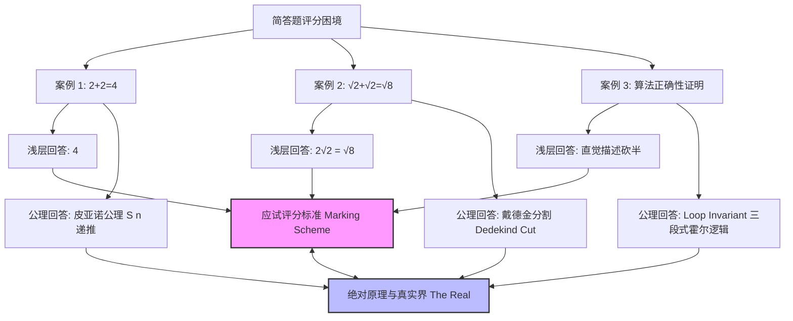

在标准化教育与测试体系中，简答题（Short-Answer Questions）始终被视作一种介于“客观选择题”与“自由论述题”之间的中庸产物。命题人与阅卷系统假定存在一个兼具“简洁性”与“精确性”的标准化参考答案（Marking Scheme）。

然而，当一个看似简单的题目触及学科底层的深层原理时，一种极为离奇的**评分迷局与评价失语**便陡然爆发：

当受考者给出最浅显、最符合惯性直觉的符号结果时，系统封其为满分；而当受考者给出最严格、最底层的公理体系与形式化推导时，评分系统反而手足无措，甚至将其判为“偏题”、“冗余”或“扣分”。

这种评价机制的死穴，究竟是如何在数学、逻辑与计算机科学中全面显现的？

---

### 1. 三重对立矩阵：浅层符号 vs 底层绝对真理

为了彻底拆解这种评价机制的荒诞性，我们可以构建三个跨越不同学科层级的典型对立矩阵。



#### 案例一：$2 + 2 = ?$

- **回答 A（浅层符号习惯）**：
  直接输出 `4`。这是日常算术的直觉与熟练的符号操作。
- **回答 B（皮亚诺公理 Peano Axioms 严密构造）**：
  从皮亚诺公理体系、后继函数 $S(n)$ 与加法递归定义出发：
  1. 定义 $0 \in \mathbb{N}$，且定义后继元素 $1 = S(0), 2 = S(1), 3 = S(2), 4 = S(3)$；
  2. 引入加法的两条公理定义：对于任意自然数 $m, n$，有 $m + 0 = m$，且 $m + S(n) = S(m + n)$；
  3. 进行严格推导：
     $$2 + 2 = 2 + S(1) = S(2 + 1) = S(2 + S(0)) = S(S(2 + 0)) = S(S(2)) = S(3) = 4$$

**评价困境**：在常规阅卷标准（Marking Scheme）中，采分点只有冷冰冰的数值 `4`。如果一个考生在答题卡上写下了整套严密的皮亚诺公理推导，评分大他者会给予他更高阶理性的尊重，还是会因为“没有直接在第一行写出 4”而扣掉步骤分？

---

#### 案例二：$\sqrt{2} + \sqrt{2} = ?$

- **回答 A（应试化简规约）**：
  简单的符号代数化简：
  $$\sqrt{2} + \sqrt{2} = 2\sqrt{2} = \sqrt{4} \times \sqrt{2} = \sqrt{8}$$
- **回答 B（实数完备性构造：戴德金分割 Dedekind Cut / 柯西序列）**：
  指出 $\sqrt{2}$ 并不是一个既定的简单符号，而是一个无理数。必须在有理数集 $\mathbb{Q}$ 上建立 **戴德金分割（Dedekind Cut）** $A = \{x \in \mathbb{Q} \mid x < 0 \text{ 或 } x^2 < 2\}$，或者通过柯西序列等价类来定义实数完备性。证明两个戴德金分割集相加后的上确界恰好收敛于无理数 $\sqrt{8}$。

**评价困境**：阅卷老师手里的采分点是 $2\sqrt{2}$ 或 $\sqrt{8}$。面对戴德金分割对无理数加法的完备性构造证明，评分标准陷入了尴尬的沉默与失语。

---

#### 案例三：二分查找算法的正确性证明（直觉口语描述 vs 形式化循环不变式 Loop Invariant）

在计算机科学的算法简答题中，要求证明以下 **二分查找算法（Binary Search）** 的正确性：

```cpp
int binarySearch(const vector<int>& nums, int target) {
    int left = 0, right = nums.size() - 1;
    while (left <= right) { // 循环不变式 P: 若 target 存在，必在 [left, right] 中
        int mid = left + (right - left) / 2;
        if (nums[mid] == target) return mid;
        else if (nums[mid] < target) left = mid + 1;
        else right = mid - 1;
    }
    return -1; // 找不到目标值
}
```

- **回答 A（直觉口语现象描述）**：
  “因为代码在每一次循环中都取中间值 `mid` 与 `target` 比较，每次都把搜索区间砍掉了一半，区间越来越小，所以循环结束时如果没找到就说明数组里肯定没有，算法绝对正确。”
- **回答 B（二分查找的形式化 Hoare 逻辑与 Loop Invariant 三段式证明）**：
  针对 `while (left <= right)` 循环，严格定义 **循环不变式（Loop Invariant）** $P$:
  *若目标值 $target$ 存在于原有序数组 $nums[0 \dots n-1]$ 中，则其索引 $k$ 必定落于当前的闭区间 $[left, right]$ 之内。*
  
  并按形式化验证的霍尔逻辑完成三段式数学归纳：
  1. **初始化（Initialization）**：在循环第一次迭代前，$left = 0, right = n - 1$，此时闭区间覆盖整个数组，不变式 $P$ 显然成立；
  2. **保持（Maintenance）**：假设某次迭代开始前 $P$ 为真。计算 $mid = \lfloor (left + right) / 2 \rfloor$。若 $nums[mid] < target$，因数组升序，索引范围缩减为 $[mid + 1, right]$；若 $nums[mid] > target$，范围缩减为 $[left, mid - 1]$。更新后新的闭区间依然包含目标值 $target$（若存在），不变式 $P$ 维持为真；
  3. **终止（Termination）**：当循环因 $left > right$ 终止时，闭区间 $[left, right]$ 为空集。结合不变式 $P$（“若存在必定在区间内”），推导出目标值 $target$ 必不在数组中，形式化证明算法绝对正确。

**评价困境**：如果评分标准写的是直觉口语描述，写形式化 Loop Invariant 三段式证明的考生可能会被扣分（被阅卷系统判定为“繁琐冗余”、“答非所问”）；而如果标准答案写的是形式化 Loop Invariant，写直觉口语描述的考生直接被判 0 分（被判定为“缺乏严谨性”）。


---

### 2. 哲学批判：“大他者”的假象与应试无能

在精神分析与后结构主义哲学中，这套评分标准与参考答案扮演了一个极其冷酷的角色——**“大他者”（The Big Other）**。

#### A. “大他者”的假象与无能
在考场与评估体系中，受考者无意识地假定存在一个无所不知、掌握终极真理的权威“大他者”（即阅卷标准与评分系统）。

然而，当皮亚诺公理、戴德金分割或循环不变式形式化证明被展现时，“大他者”的真实面目暴露无遗：**大他者不仅不是无所不知的真理化身，它反而是贫乏、机械、缺乏深度且极其脆弱的符号规则。**

当真实的公理撞击符号化的参考答案时，大他者并没有表现出对深层理性的包容，反而显露出无法识别绝对真理的冷酷无能。

#### B. 意识形态的“被迫降维”与犬儒服从
这便导出了最深刻的意识形态规训：**为了在一个由浅薄大他者主导的体制内获取高分，个体必须学会“被迫降维”。**

一个深谙数学底蕴与形式化验证的受考者，在面对“$2+2=?$”或“证明算法正确性”时，内心清楚地知道皮亚诺公理和 Loop Invariant 才是最无懈可击的本体；但他为了迎合阅卷标准，不得不压抑自己的高阶认知，主动将思维降维到“写出 4”或“写出直觉描述”的低阶水平。

这种**“明知有更深刻的真理，却为了分数主动假装愚笨、去迎合浅薄标准”**的行为，正是现代教育中最普遍也最深沉的犬儒意识形态（Cynical Ideology）。

#### C. 符号秩序对真实界的暴力剪裁
评价体系的实质，是用一套统一的符号模板对复杂多元的精神与理性（The Real）进行暴力剪裁。

不论是皮亚诺的后继函数，还是戴德金的实数分割，亦或是霍尔逻辑的不变式，都在评分细则的“采分点匹配”中被抽干了思想的生命力，退化成了冷冰冰的得分项。

---

### 3. 评价机制的未来困境与终极思考

当考试与评估逐渐被自动化算法与 AI 阅卷所接管时，简答题的评分困境不仅没有被消除，反而被进一步强化：
- AI 阅卷与标准答案库更容易陷入对“表面符码”的机械匹配；
- 能够优雅给出皮亚诺公理或戴德金分割的异质化智力，反而更容易被机器算法判定为“偏离主题”或“噪音”。

这迫使我们不得不重新审视评价机制的终极价值：

如果一项考核的最高奖励只赋予那些最擅长“猜中浅层参考答案”的降维迎合者，而将触及底层本质的公理探索排除在外，那么这种考核机制到底是在筛选人类的智慧，还是在批量生产迎合权威大他者的数字机器？

划破大他者的虚妄假象，敢于在浅薄的评分细则面前守护深层的公理与理性，或许才是夺回人类认知主权的真正开始。
